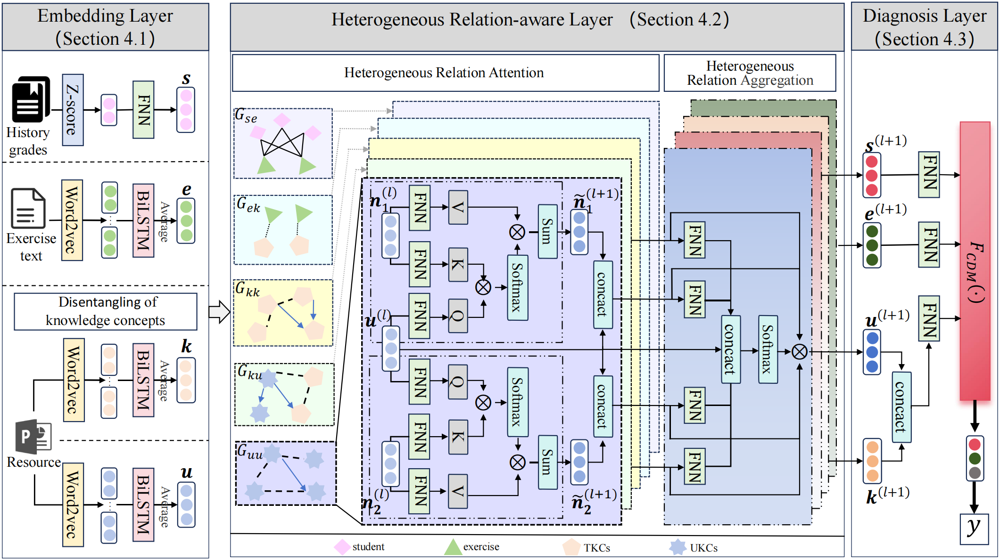

# Disentangling Heterogeneous Knowledge Concept Embedding for Cognitive Diagnosis on Untested Knowledge



 In this paper, we propose a novel Disentangling Heterogeneous Knowledge Cognitive Diagnosis framework on untested knowledge(DisKCD). Specifically, we leverage course grades, exercise questions, and resources to learn the potential representations of students, exercises, and knowledge concepts. In particular, knowledge concepts are disentangled into tested and untested based on the limiting actual exercises. We construct a heterogeneous relation graph network via students, exercises, tested knowledge concepts(TKCs), and UKCs. Then, through a hierarchical heterogeneous message-passing mechanism, the fine-grained relations are incorporated into the embeddings of the entities. Finally, the embeddings will be applied to multiple existing cognitive diagnosis models to infer students’ proficiency on UKCs.


## 1. Dependencies:

```
python==3.8
torch==1.8.1+cu111
dgl-cu111==0.6.1
numpy
json
sklearn
```

## 2. Data Set：

We use preprocessed data from JAD,SDP and Junyi. Where JAD and SDP consist of student response data extracted from the final exams of two courses, "Java Application Development" and "Software Design Patterns", offered during the 2021-2022 academic year in the software engineering major at a Chinese university. If you want to download the preprocessed data directly, please skip to the next subsection.

The structure of the generated file should be as follows, please note that the structure of our three datasets is the same, here we take JAD as an example:

```
│  log_data.json
│  test_set.json
│  train_set.json
│  untestdata.json
│
├─data_original
│      exercise_em.npy 
│      id_exercise.csv
│      id_TKC.csv
│      id_UKC.csv
│      q.csv
│      stu-z-score.csv
│      tested_exer_log.csv
│      TKC_em.npy
│      TKC_ppt.txt
│      UKC_em.npy
│      UKC_ppt.txt
│      untested_exer_log.csv
│
└─graph
        e_from_k.txt
        e_from_u.txt
        KK_directed.txt
        KK_Undirected.txt
        KUK_directed.txt
        KUK_Undirected.txt
        k_from_e.txt
        UKK_directed.txt
        UKK_Undirected.txt
        UKUK_directed.txt
        UKUK_Undirected.txt
        u_from_e.txt
```

**`log_data.json`**： Student exercising records.
**`train_set.json`**： Data file for training.
**`test_set.json`**： Data file for testing.

**`graph/e_from_u.txt and graph/u_from_e.txt`**：Interaction relations in the `student-exercise interaction subgraph`,  where each row is： `student_ID\t exercise_ID` and `exercise_ID\t student_ID`,  respectively.

**`graph/e_from_k.txt and graph/k_from_e.txt`**：Correlation relations in the exercise-TKC correlation subgraph`exercise_ID\t student_ID`, where each row is：`TKC_ID\t exercise_ID` and `exercise_ID\t TKC_ID`.

**`graph/KK_directed.txt`**：Prerequisity relations in the `TKC-TKC dependency subgraph`,  where each row is：`precursor_TKC_ID\t succeed_TKC_ID`.
**`graph/KK_Undirected.txt`**：Similarity relations in the `TKC-TKC dependency subgraph`,  where each row is：`TKC_ID\t similar_TKC_ID`.

**`graph/KUK_directed.txt`**：Prerequisity relations in the `TKC-UKC dependency subgraph`,  where each row is：`precursor_UKC_ID\t succeed_TKC_ID`。
**`graph/KUK_Undirected.txt`**：Similarity relations in the `TKC-UKC dependency subgraph`, where each row is：`UKC_ID\t similar_TKC_ID`。
**`graph/UKK_directed.txt`**：Prerequisity relations in the `TKC-UKC dependency subgraph`,  where each row is：`precursor_TKC_ID\t succeed_UKC_ID`。
**`graph/UKK_Undirected.txt`**：Similarity relations in the `TKC-UKC dependency subgraph`,  where each row is：`TKC_ID\t similar_UKC_ID`。

**`graph/UKUK_directed.txt`**：Prerequisity relations in the `UKC-UKC dependency subgraph`,  where each row is：`precursor_UKC_ID\t succeed_UKC_ID`。

**`graph/UKUK_Undirected.txt`**：Similarity relations in the `UKC-UKC dependency subgraph`,  where each row is：`UKC_ID\t similar_UKC_ID`.

## 3. Training DisKCD：

(Assuming just one GPU) Prepare prediction and training directory

```
mkdir model
mkdir result
```

Divide the data set

```python
python divide_data.py
```

Run `divide_data.py` to split the original dataset `data/log_data.json` into a training set, a validation set, and a test set. Of course, in our project, the split data is already provided, so you can skip this step.

Train the model, such as `RCD-DisKCD`

```python
python main.py
```

The parameters in the model are set in `DisKCD/utils.py` and we provide a default set of parameters.

## 4. Diagnosis result

```python
python diagnosis.py
```

If the model achieves the best performance when epoch=13.
